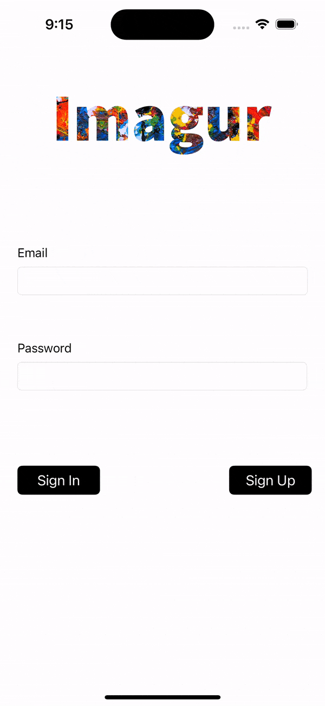
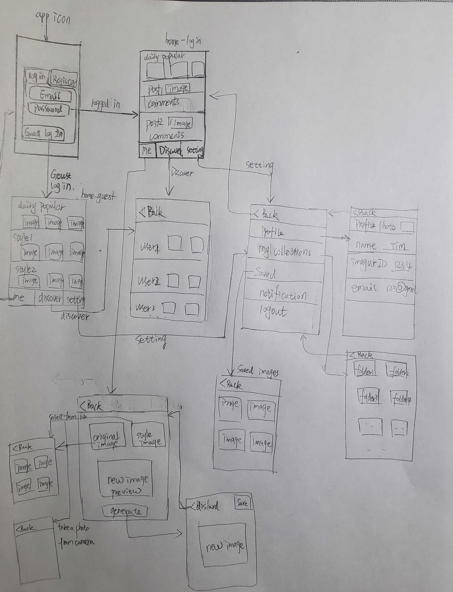

# Imagur
## Table of Contents

1. [Overview](#overview)
2. [Product Spec](#product-spec)
3. [Wireframes](#wireframes)
4. [Schema](#schema)

## Overview
### Progress (after Milestone 1)
<div align="left">
    
</div>


### Description

We are building an app that allows users to upload images and created styled images that can be shared.

For example we can be given the following image from a user:

<div align="left">
  
</div
  
Then we can take a style image:
  
<div align="left">
  
</div>

When we combine them we will get a final stylized image:

<div align="left">
  
</div>

### App Evaluation

- **Category:** Image Editing / Creation Tool
- **Mobile:** This app could be used on mobile but we will also provide a Mac version such that get faster speed to generate images with new style.
- **Story:** Show how the painting masters would paint when they face our modern scenes with their painting style. And how we create the mixed style of the painting masters which not possible as they may live in the different era.
- **Market:** Any individual could choose to use this app but we see artists and photographers finding appeal.
- **Habit:** User could use this app freely as they want depending on what they want to share, and what exactly they're looking for.
- **Scope:** First we would build out the ability to style images based on predefined styles. We would like to add more styles and allows users more customization.

## Product Spec

### 1. User Stories (Required and Optional)

**Required Must-have Stories**
- [x] User creates user and logs in to see their saved images.
- [ ] User sees feed of their created images.
- [x] User takes a photo or uploads one from camera feed to be styled.
- [ ] User selects from a predefined list of styles to apply to their image.
- [ ] User sees their image become a styled image based on their selected style.
- [ ] User can upload their styled image to a database to be saved.

**Optional Nice-to-have Stories**

- Ability to share with social media.
- Ability to upload their own styles.
- Add a social component that allows users to see other user's creations.

### 2. Screen Archetypes

- Login / Register - User signs up or logs in.

  - This will be used to store images and connect them to their respective accounts.

- Studio Screen - User will be able to see all the styled images they have created.

  - A feed like screen will appear with all their images they have created.

- Camera Screen - User will be able to upload their image (or potential take a photo).

  - Upon uploading image they will be shown a selection of styles they can apply to their photo.

- Applying Style Screen - User will be able to see what their photo looks like with the selected style.

  - Upon selecting the style they will be able to see what their styled image looks like. They will able to decided whether to continue or go back and choose a different style.

- Save Image Screen - User will be able to save their newly created styled image.
  - Upon finishing their styled image users will be able to upload it to the studio so they can view later or save it to their camera roll. They will also be able to potentially upload the styled image to social media.

### 3. Navigation

**Navigation**

- Studio Page (Feed)
- Camera Page (Upload or Take Photo)
- Style Page (Select from options)
- Save Image (Upload to Database)

**Flow Navigation** (Screen to Screen)

- Optional Login (everything works fine except they don't have a studio feed).
- Studio Feed (if logged in) -> See all created images saved to studio.
- Camera -> Upload new image to be styled.
- Applying Style -> Applies style to image.
- Save Image -> Saves image to camera roll (or studio if they logged in).

## Wireframes
### Low Fidelity Wireframes

<div align="left">
  
</div>

### High Fidelity Wireframes

[Digital Wireframes](https://www.figma.com/file/b7KjMWtLoTLixNmnGm6Rfr/Team26?node-id=0%3A1)

[Interactive Prototype](https://www.figma.com/proto/b7KjMWtLoTLixNmnGm6Rfr/Team26?node-id=1%3A7&scaling=scale-down&page-id=0%3A1&starting-point-node-id=1%3A7)

## Schema
### Models

#### User

| Property  | Type     | Description                                    |
| --------- | -------- | ---------------------------------------------- |
| objectId  | String   | unique id for the user post (default field)    |
| username  | String   | name of user                                   |
| password  | String   | password of user                               |
| email     | String   | email of the user (optional)                   |
| createdAt | DateTime | date when post is created (default field)      |
| updatedAt | DateTime | date when post is last updated (default field) |

#### Post

| Property  | Type            | Description                                    |
| --------- | --------------- | ---------------------------------------------- |
| objectId  | String          | unique id for the user post (default field)    |
| author    | Pointer to User | image author                                   |
| image     | File            | image that user posts                          |
| createdAt | DateTime        | date when post is created (default field)      |
| updatedAt | DateTime        | date when post is last updated (default field) |

### Networking
#### List of network requests by screen

- Login / Sign Up Screen - (Read/Get) Check if the user exists
  ```swift
  let username = usernameField.text!
  let password = passwordField.text!
  
  PFUser.logInWithUsername(inBackground: username, password: password) {
      (user, error) in
         if user != nil {
            self.performSegue(withIdentifier: "loginSegue", sender: nil)
         } else {
            print("Error: \(error?.localizedDescription)")
         }
      }
   ```

- Sign Up Screen
  -(Create/Post) Create User
  ```swift
  let user = PFUser()
  user.username = usernameField.text
  user.password = passwordField.text
  
  user.signUpInBackground {
      (success, error) in
         if success {
            self.performSegue(withIdentifier: "loginSegue", sender: nil)
         } else {
            print("Error: \(error?.localizedDescription)")
         }
      }
   ```

- Studio Screen - (Read/GET) Query all posts where user is author
  ```swift 
  let query = PFQuery(className:"Post")
  query.whereKey("author", equalTo: currentUser)
  query.order(byDescending: "createdAt")
  query.findObjectsInBackground { 
      (posts: [PFObject]?, error: Error?) in 
         if let error = error { 
            print(error.localizedDescription) 
         } else if let posts = posts {
            print("Successfully retrieved \(posts.count) posts.") 
         }
   }
  ```

- Save Image Screen - (Create/Post) Post image created
  ```swift
  let post = PFObject(className: "Posts")
  post["author"] = PFUser.current()!
  let imageData = imageView.image!.pngData()
  let file = PFFileObject(name: "image.png", data: imageData!)
  
  post["image"] = file
  
  post.saveInBackground {
  (success, error) in
      if success {
         self.dismiss(animated: true, completion: nil)
      } else {
         print("Error: \(error?.localizedDescription)")
      }
   }
   ```
